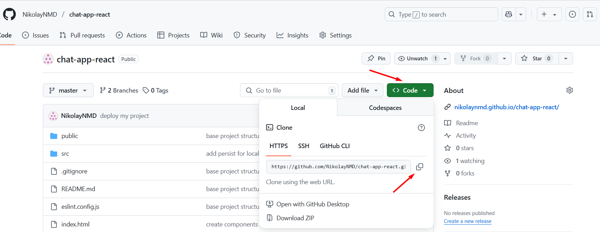
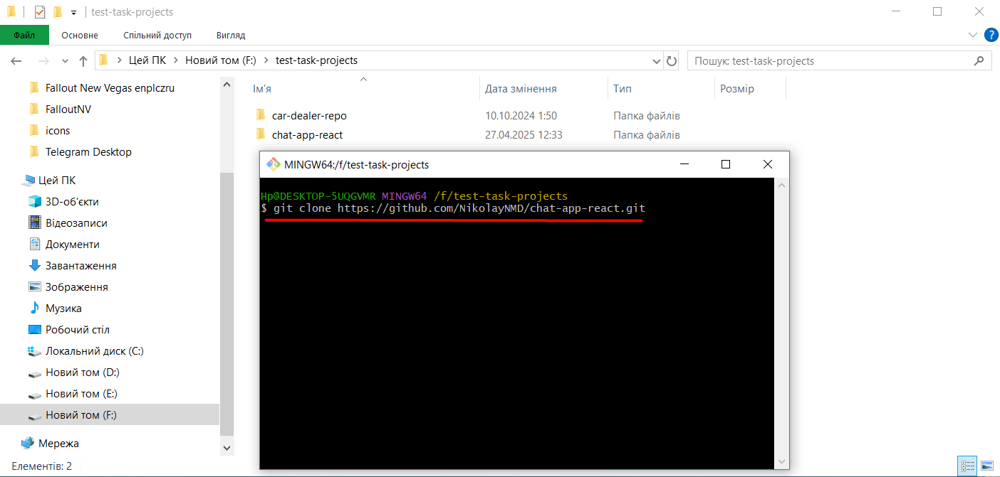

# Chat App

Цей проект було створено за допомогою Vite.

## 🚀 How to Run the Project

1. Copy HTTPS of my repository.



2. Paste this path into your terminal or bash and type clone command => Enter.



3. Open this project in your IDE.

- Make sure you have the LTS version of Node.js installed on your computer. [Download and install](https://nodejs.org/en/) it if necessary.

- Install all dependencies. In the terminal, type:

```
   npm install
```

- Then start development mode, type:

```
   npm run dev
```

- Then open: http://localhost:5173/chat-app-react
